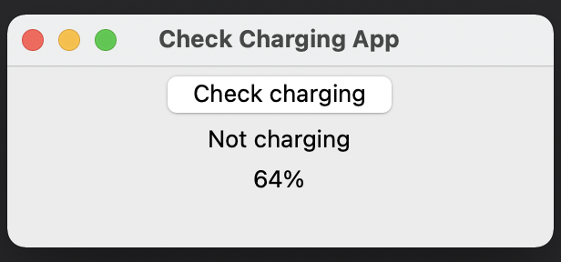

# check-charging-tkinter-sample



## Usage
Install psutil.

```sh
pip install psutil
```

Start app

```sh
python main
```

## Build the executable file
Create an executable file using [cx_Freeze](https://github.com/marcelotduarte/cx_Freeze).

### Mac

```sh
python setup.py bdist_mac
```